<div align="center">

# ✦ gitglance

**Beautiful, self-hostable GitHub stats cards for your README.**
Many themes, several visual styles, and no rate-limit headaches.


<br/>

<a href="https://gitglance-eight.vercel.app"></a>

<br/>

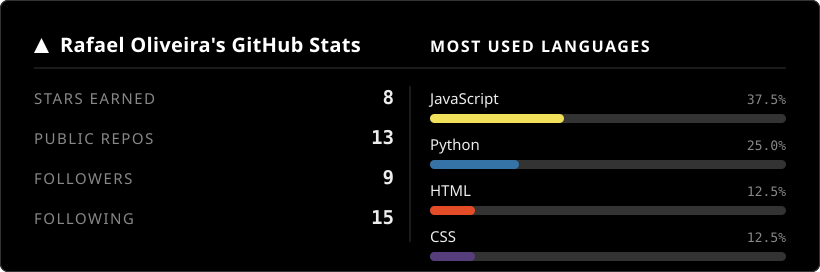

</div>

## Why gitglance

Most README stats cards depend on one shared public service that constantly hits GitHub's rate limit and gets paused (you have probably seen the broken image on someone's profile). gitglance is built to be **self-hosted in one click**: deploy your own instance, give it your own GitHub token, and your cards never break because of someone else's traffic.

- 🎨 **16 visual styles**: `default`, `vercel`, `vercel-lines`, `mono`, `terminal`, `glass`, `minimal`, `neon`, `gradient`, `aurora`, `mesh`, `waves`, `dots`, `grid`, `orbs`, `outline`
- 🌈 **21 color themes**: dark, vercel, tokyonight, dracula, catppuccin, nord, gruvbox, rosepine, cyberpunk, ocean, sunset, forest, coffee, midnight, lavender, crimson, and more
- 📊 **8 card types**: stats, top languages, combined, donut chart, circular gauges, bar chart, repository pin, and commit activity
- 🛠️ **Fully customizable** via URL params (colors, radius, width, title, borders)
- 🌌 **Rich backgrounds**: aurora light blobs, mesh gradients, layered waves, dot grids, all in pure SVG (no external assets, nothing to break)
- 🎬 **Animations that degrade gracefully**: bars grow, charts fade in, aurora drifts, grid zones pulse, orbs float, a light sweep crosses vercel-lines. Cards always render complete even where animations do not run
- 🧰 **Card builder page**: open your instance root, pick options in dropdowns and copy the code
- ⚡ **Fast SVG** output with sensible caching
- 🔒 **Your token, your limits**: self-host and never get rate limited again

## Styles

| `vercel` | `terminal` |
|:--------:|:----------:|
|  | 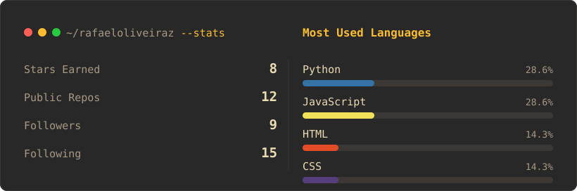 |
| **`default`** | **`glass`** |
| 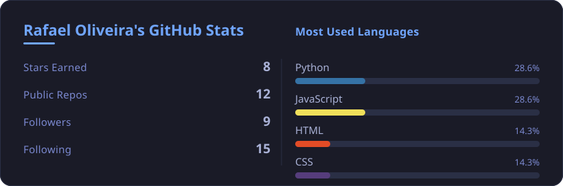 | 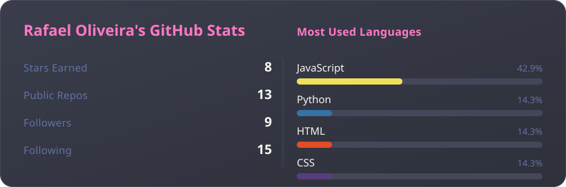 |
| **`vercel-lines`** (animated sweep) | **`mono`** (pure black and white) |
|  | 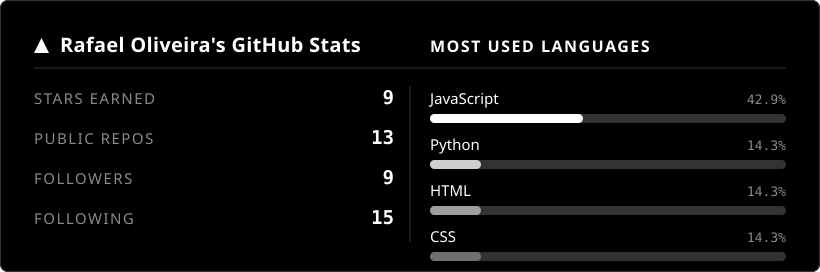 |
| **`grid`** (zones pulse) | **`orbs`** (floating circles) |
| 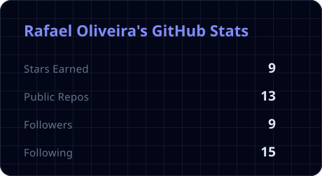 | 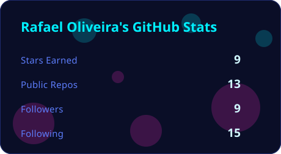 |

## Card types

| Stats | Languages |
|:-----:|:---------:|
| 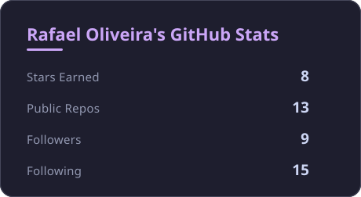 | 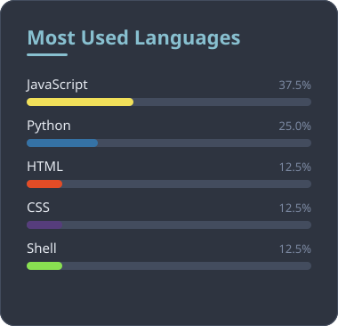 |

## Chart cards

| Donut | Rings |
|:-----:|:-----:|
| 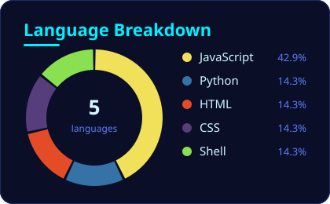 | 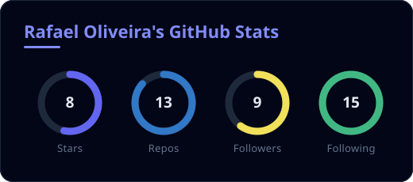 |
| **Bars (neon style)** | **Bars** |
| 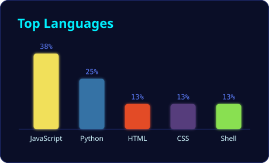 | 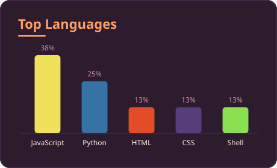 |

## Repo pin and commit activity

| Repository card | Commit activity (28 days) |
|:---------------:|:-------------------------:|
| 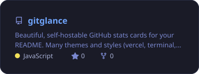 | 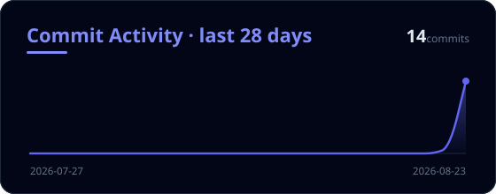 |

## Advanced backgrounds

| Aurora | Mesh |
|:------:|:----:|
|  |  |
| **Waves** | **Dots** |
| 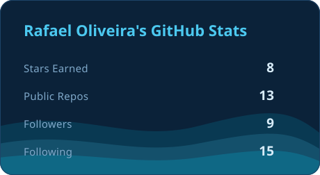 | 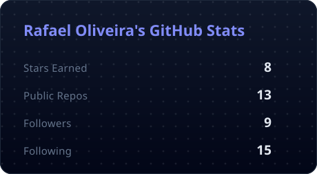 |

## More style combos

| Outline | Gradient |
|:-------:|:--------:|
| 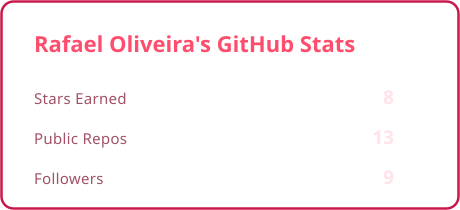 | 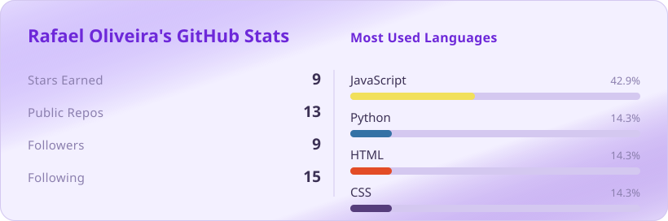 |

## Live demo

Use the **[card builder](https://gitglance-eight.vercel.app)** to assemble your card visually and copy the code. A gallery of every style and theme is available at **[gitglance-eight.vercel.app/preview](https://gitglance-eight.vercel.app/preview)**. Point any card at your own username by changing the `username` parameter.

## Quick start

gitglance is meant to run as **your own** instance so it uses your rate limit.

1. Deploy this repo to Vercel (it is preconfigured, `vercel.json` included). Use the "New Project" flow and import this repository.
2. Optional but recommended: add an environment variable `GITHUB_TOKEN` (a classic token with `public_repo` scope) so you get 5000 requests/hour instead of 60.
3. Use your deployment URL in any README:

```md

```

You can also try any card right now on the reference instance, just swap in your username:

```md

```

## API

Base: your deployment URL (live reference instance: `https://gitglance-eight.vercel.app`)

| Endpoint | Card |
|----------|------|
| `/api/stats` | Overview numbers (stars, repos, followers, following) |
| `/api/langs` | Most used languages |
| `/api/combined` | Stats and languages side by side |
| `/api/donut` | Donut chart of languages with legend |
| `/api/rings` | Circular gauges for the four stats |
| `/api/bars` | Vertical bar chart of languages |
| `/api/repo` | Repository pin card (`username` + `repo` params) |
| `/api/activity` | Commit activity area chart (`days` param, 7 to 60, default 28) |
| `/api?type=stats\|langs\|combined` | Same, via the `type` param |

### Parameters

All parameters are optional except `username`.

| Param | Description | Example |
|-------|-------------|---------|
| `username` | GitHub username (required) | `username=torvalds` |
| `style` | `default`, `vercel`, `vercel-lines`, `mono`, `terminal`, `glass`, `minimal`, `neon`, `gradient`, `aurora`, `mesh`, `waves`, `dots`, `grid`, `orbs`, `outline` | `style=aurora` |
| `theme` | Color theme (see list below) | `theme=dracula` |
| `langs_count` | Number of languages to show (1 to 10) | `langs_count=6` |
| `title` | Custom card title | `title=My%20Stats` |
| `hide_title` | Hide the title | `hide_title=true` |
| `hide_border` | Hide the outer border | `hide_border=true` |
| `border_radius` | Corner radius in px | `border_radius=20` |
| `width` | Card width in px | `width=500` |
| `title_color` | Override title color (hex, no #) | `title_color=ff79c6` |
| `text_color` | Override text color | `text_color=ffffff` |
| `bg_color` | Override background color | `bg_color=0d1117` |
| `border_color` | Override border color | `border_color=30363d` |

### Themes

`dark`, `light`, `vercel`, `tokyonight`, `dracula`, `nord`, `gruvbox`, `catppuccin`, `synthwave`, `rosepine`, `onedark`, `monochrome`, `cyberpunk`, `ocean`, `sunset`, `forest`, `coffee`, `midnight`, `lavender`, `crimson`

## Run locally

```bash
npm install
GITHUB_TOKEN=your_token npm start
# open http://localhost:3000/preview to see every style and theme
```

The `/preview` route renders a gallery of all styles and themes for quick visual checks.

## How it works

gitglance fetches public data from the GitHub REST API and renders a self-contained SVG (no headless browser). Cards are cached for six hours. Because you run your own instance with your own token, availability is in your hands, not a shared public service.

## Contributing

New themes and styles are very welcome. A theme is a small palette in `lib/themes.js`; a style is a set of visual tokens in `lib/render.js`. Open a PR with a screenshot.

## License

[MIT](LICENSE) © Rafael Oliveira

<div align="center">
<br/>
If gitglance is useful to you, a ⭐ helps other people find it.
</div>
